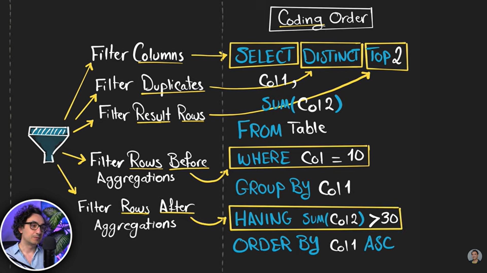
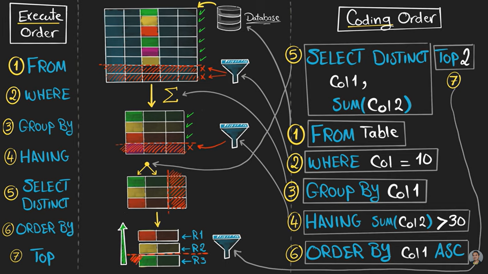
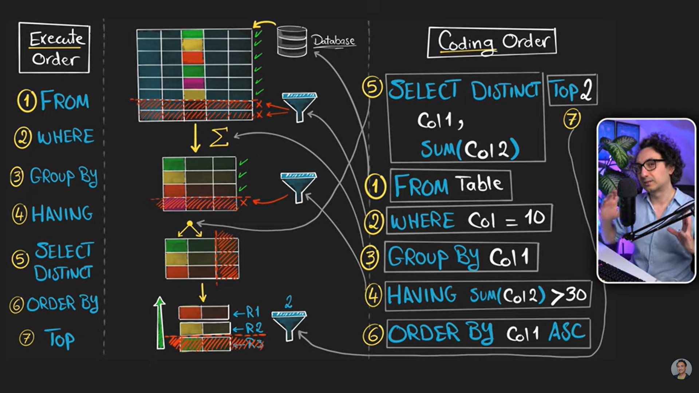

# SQL SELECT Statement Notes

## Overview

The `SELECT` statement is used to retrieve data from database tables.

- Used to select data from one or more tables.
- Used to fetch records from a database.

---

# 1. Retrieve All Data

Retrieve every column and every row from a table.

```sql
SELECT * FROM student;
```

---

# 2. Retrieve Specific Columns

Pick only the columns you need.

```sql
SELECT sname, marks
FROM student;
```

---

# 3. WHERE Clause

## Definition

The `WHERE` clause is used to filter rows/data based on a condition.

### Example 1: Students with marks greater than or equal to 70

```sql
SELECT *
FROM student
WHERE marks >= 70;
```

### Example 2: Student with name Ravi

```sql
SELECT *
FROM student
WHERE sname = "Ravi";
```

### Example 3: Select specific columns with a condition

```sql
SELECT
    sname,
    marks
FROM student
WHERE sname = "Ravi";
```

---

# 4. ORDER BY Clause

## Definition

The `ORDER BY` clause is used to arrange data in ascending or descending order.

### Example: Descending order by student ID

```sql
SELECT *
FROM student
ORDER BY sid DESC;
```

---

## Nested ORDER BY

### Definition

Used to arrange data in ascending or descending order, but refines the result further.

For example:

If data is sorted by name and multiple students have the same name, another column can be used to refine the sorting and produce more accurate results.

### Example

```sql
SELECT *
FROM student
ORDER BY
    sname ASC,
    sid DESC;
```

---

# 5. GROUP BY Clause

## Definition

- Combines rows with the same value.
- Aggregates a column by another column.

### Example

Table:

| Name   | Country | Score |
| ------ | ------- | ----- |
| Maria  | Germany | 350   |
| John   | USA     | 900   |
| Gaury  | UK      | 750   |
| Martin | Germany | 500   |
| Peter  | USA     | 0     |

Since Germany and USA appear multiple times, GROUP BY combines them and calculates aggregate values.

Result:

| Country | Total Score |
| ------- | ----------- |
| Germany | 850         |
| USA     | 900         |
| UK      | 750         |

### Query

```sql
SELECT
    sname,
    SUM(marks) AS total_marks,
    COUNT(sid) AS total_customers
FROM student
GROUP BY sname;
```

---

# 6. HAVING Clause

## Definition

Filter aggregated data.

- Filters data after aggregation.
- Can be used only with GROUP BY.
- HAVING is used to check conditions on aggregated values.

### Example

If we use:

```sql
HAVING SUM(score) > 800
```

Then only rows whose total score is greater than 800 are returned.

Example aggregated table:

| Country | Score |
| ------- | ----- |
| Germany | 850   |
| USA     | 900   |
| UK      | 750   |

Result:

| Country | Score |
| ------- | ----- |
| Germany | 850   |
| USA     | 900   |

### Query

```sql
SELECT
    sname,
    SUM(marks) AS total_marks,
    COUNT(sid) AS total_customers
FROM student
GROUP BY sname
HAVING total_marks > 100;
```

---

# 7. HAVING vs WHERE

## Main Difference

### WHERE

- Filters data before aggregation.

### HAVING

- Filters data after aggregation.

### Example

```sql
SELECT
    sname,
    SUM(marks) AS total_marks,
    COUNT(sid) AS total_customers
FROM student
WHERE marks > 70
GROUP BY sname
HAVING SUM(marks) > 100;
```

---

# 8. DISTINCT Keyword

## Definition

Removes duplicate (repeated) values.

- Each value appears only once.

### Example

```sql
SELECT DISTINCT
    sname AS name
FROM student;
```

---

# 9. TOP / LIMIT

## Definition

Restricts the number of rows returned.

### Important

- `TOP` keyword is used only in Microsoft SQL Server (SSMS).
- MySQL uses `LIMIT`.

---

## Microsoft SQL Server (SSMS)

```sql
SELECT TOP 3 *
FROM student;
```

---

## MySQL

```sql
SELECT *
FROM student
LIMIT 3;
```

### Last 3 Students by ID

```sql
SELECT *
FROM student
ORDER BY sid DESC
LIMIT 3;
```

---

# Execution Order vs Coding Order







---

# Quick Revision

| Clause   | Purpose                             |
| -------- | ----------------------------------- |
| SELECT   | Retrieve data                       |
| WHERE    | Filter rows before aggregation      |
| ORDER BY | Sort data                           |
| GROUP BY | Group similar values                |
| HAVING   | Filter grouped/aggregated data      |
| DISTINCT | Remove duplicates                   |
| LIMIT    | Restrict rows returned (MySQL)      |
| TOP      | Restrict rows returned (SQL Server) |

---

## Learning Summary

By completing these notes, you learned:

- Retrieving all data and specific columns
- Filtering rows using WHERE
- Sorting using ORDER BY
- Multi-column sorting
- Grouping records using GROUP BY
- Filtering aggregated results using HAVING
- Difference between WHERE and HAVING
- Removing duplicates with DISTINCT
- Limiting rows using TOP and LIMIT
